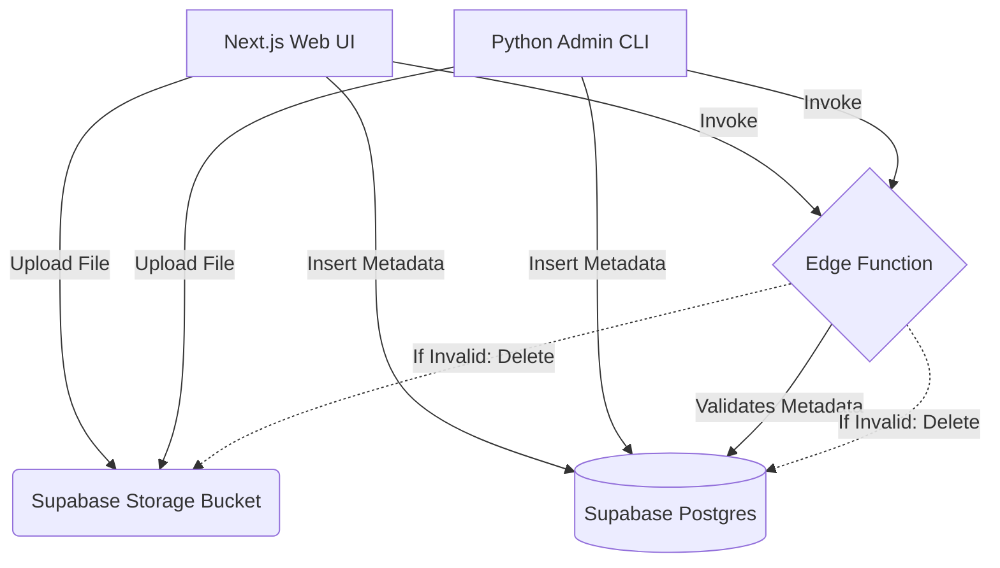

# 🎬 FileVault: Supabase Full-Stack CRUD & Edge Validation


A production-ready file management application demonstrating robust file storage, Edge Function validation, metadata tracking, and relational data CRUD using a single **Supabase backend**. The project features a dual-client architecture with a Python Admin CLI and a modern Next.js web application.

---

## 🌐 Live Demo & Media
- **Live App:** [https://supabase-crud-app-.vercel.app/](https://supabase-crud-app-.vercel.app/) *(Update with your Vercel URL)*
- **Demo Video:** *(Insert Demo GIF/Video Link Here)*

---

## 📸 Screenshots

| Vault Dashboard | File Validation Flow |
| :---: | :---: |
|  |  |
| *Modern Dark-Mode UI with User Segregation* | *Edge Function intercepting invalid uploads* |

*(Replace the placeholder links above with actual screenshots of your Next.js app!)*

---

## ✨ Key Features
- **🔄 Universal CRUD:** Create, Read, Update, and Delete operations synchronized across both the CLI and Web Application.
- **🛡️ Edge Server Validation:** A Deno Edge Function strictly validates file sizes (<10MB) and MIME types before persisting them.
- **🔐 User Segregation:** Next.js frontend isolates files by `owner` username to simulate multi-tenant secure storage.
- **💅 Pro-Max UI:** Built with Next.js App Router, Tailwind CSS, and Lucide React featuring a sleek glassmorphism dark theme.
- **🗄️ Unified Backend:** Leverages Supabase Postgres for metadata and Supabase Storage for binaries.

---

## 🛠️ Tech Stack Table

| Category | Technology | Purpose / Role |
|----------|------------|----------------|
| **Frontend** | Next.js 14, React, Tailwind CSS | Web dashboard UI and client interaction. |
| **Backend** | Supabase (Postgres & Storage) | Database for metadata and bucket for binary storage. |
| **Serverless** | Supabase Edge Functions (Deno) | Middleware logic to validate uploads securely on the server. |
| **CLI** | Python, `supabase-py` | Terminal-based admin management client. |
| **Icons** | Lucide React | Modern scalable UI icons. |

---

## ⚙️ How It Works

1. **Authentication:** The user enters a unique username in the Next.js UI to access their segregated vault.
2. **Upload:** A file is selected and uploaded to the Supabase `user-files` Storage Bucket.
3. **Metadata:** The frontend inserts a new row into the Postgres `file_metadata` table containing the size, type, and owner.
4. **Validation:** An Edge Function is instantly invoked. It reads the database row and checks the rules.
5. **Verdict:** If the file fails validation (e.g. >10MB), the Edge Function acts as a bouncer and permanently deletes both the file from the bucket and the row from the database.

---

## 🏗️ Project Architecture



---

## 📂 Project Structure

```text
CRUD App with Python/
├── cli/
│   ├── app.py                  # Python Admin CLI application
│   ├── requirements.txt        # Python dependencies
│   └── .env                    # Secret Service Role Key
├── web/
│   ├── src/
│   │   ├── app/page.tsx        # Next.js main entry point
│   │   ├── components/         # React components (FileManager.tsx)
│   │   └── lib/supabase.ts     # Supabase JS Client initialization
│   ├── .env.local              # Publishable Anon Key
│   └── package.json
├── supabase/
│   └── functions/
│       └── validate-file/
│           └── index.ts        # Deno Edge Function logic
└── README.md
```

---

## 💻 Local Setup & Installation

### Prerequisites
- Node.js & npm installed
- Python 3.10+ installed
- A Supabase Project ([app.supabase.com](https://app.supabase.com/))

### 1. Database Setup
Run this SQL in your Supabase SQL Editor:
```sql
create table public.file_metadata (
    id uuid default gen_random_uuid() primary key,
    filename text not null,
    size bigint not null,
    content_type text,
    storage_path text not null,
    owner text,
    created_at timestamp with time zone default timezone('utc'::text, now()) not null
);
alter table public.file_metadata disable row level security;
create policy "Public Storage Access" on storage.objects for all to public using ( bucket_id = 'user-files' ) with check ( bucket_id = 'user-files' );
```
Create a public storage bucket named `user-files`.

### 2. Edge Function
```bash
npm install -g supabase
supabase login
supabase link --project-ref <your-project-ref>
supabase functions deploy validate-file
```

### 3. Python CLI
```bash
cd cli
python -m venv venv
# Activate venv: .\venv\Scripts\activate (Windows) or source venv/bin/activate (Mac/Linux)
pip install -r requirements.txt
# Create .env with SUPABASE_URL and SUPABASE_KEY (secret key)
python app.py list
```

### 4. Next.js App
```bash
cd web
npm install
# Create .env.local with NEXT_PUBLIC_SUPABASE_URL and NEXT_PUBLIC_SUPABASE_ANON_KEY
npm run dev
```
Open `http://localhost:3000` to view the app!

---

## 👤 Author & Credits

- **Author:** Arslan
- **GitHub:** [@Arslan-Codes097](https://github.com/Arslan-Codes097)
